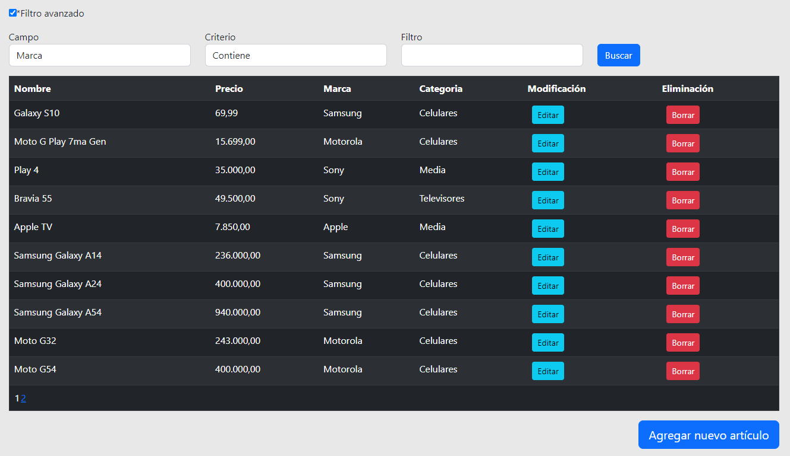

# Tienda Web

Página construida utilizando ASP .NET , Bootstrap y Microsoft SQL Server en una interfaz sencilla de compras de diversos artículos.

## Funcionalidades

1. **Registro de usuario**: Es posible crear usuarios con datos individuales, utilizando un email y password.

2. **Manejo de permisos**: El administrador puede modificar y agregar artículos a voluntad, el usuario común tiene una lista de items favoritos.

3. **Diseño**: Utilizando Bootsrap combinado con un poco de CSS la página es responsiva y con una interfaz sencilla e intuitiva.

4. **Arquitectura en capas**: Las capas estan divididas por función y responsabilidad.

## Imágenes

**Home**

**Detalle**

**Administración**

## Notas

- La creación de cuentas tiene un servicio de envío de email, pero hay que proporcionar credenciales.

- El perfil de Administrador no puede acceder a la página "Favoritos", es algo exclusivo para usuarios normales para enmarcar la diferencia de permisos.